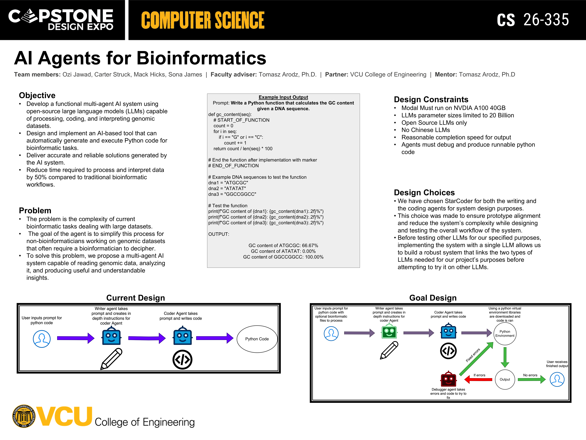
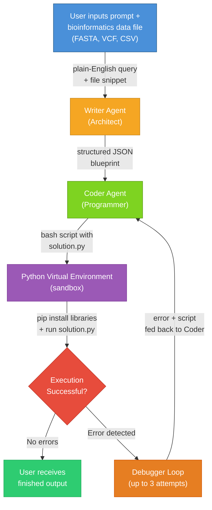

# CS-335 AI Agents for Bioinformatics
### Course/Term: CMSC-335, Fall 2025 - Spring 2026
### Members: Ozi Jawad, Carter Struck, Mack Hicks, Sona James
### CS Advisor: Dr. Tomasz Arodz
### Partner: VCU College of Engineering
### Mentor: Tomasz Arodz, Ph.D.

# Project Summary
- A multi-agent AI system that uses open-source large language models (LLMs) to automatically process, analyze, and interpret genomic datasets.
- Users provide a bioinformatics data file (FASTA, VCF, CSV) and a plain-English request — the system generates and executes a Python analysis script automatically.
- Two specialized AI agents collaborate: a Writer Agent that creates a structured execution plan, and a Coder Agent that generates and runs the Python code.
- Designed to reduce the time required to process and interpret genomic data by 50% compared to traditional bioinformatic workflows.

# Objective
- Develop a functional multi-agent AI system using open-source LLMs capable of processing, coding, and interpreting genomic datasets
- Design and implement an AI-based tool that can automatically generate and execute Python code for bioinformatic tasks
- Deliver accurate and reliable solutions generated by the AI system
- Reduce time required to process and interpret data by 50% compared to traditional bioinformatic workflows

# Problem
- The complexity of current bioinformatic tasks dealing with large datasets creates barriers for non-bioinformaticians
- Genomic datasets often require a trained bioinformatician to decipher and extract meaningful insights
- Our multi-agent AI system simplifies this process by reading genomic data, analyzing it, and producing useful and understandable insights automatically

# Design Constraints
- Must run on NVIDIA A100 40GB GPU
- LLM parameter sizes limited to 20 Billion
- Open source LLMs only
- No Chinese LLMs
- Reasonable completion speed for output
- Agents must debug and produce runnable Python code

# Design Choices
- We use Llama 3.1 Pro Coder (8B parameters) for both the Writer and Coder agents, loaded with 4-bit NF4 quantization to fit on a single GPU
- Both agents share the same model but use different system prompts and temperature settings (Writer: 0.1 for structured output, Coder: 0.0 for deterministic code)
- A self-correction loop feeds sandbox errors back to the Coder agent, allowing up to 3 automatic retries before reporting failure

# Tools
- Python 3.10+
- PyTorch (with CUDA)
- Hugging Face Transformers
- BitsAndBytes (4-bit NF4 quantization)

# Languages
- Python
- Bash

# Frameworks
- Hugging Face (model hosting and inference)
- Pydantic (structured JSON schemas)
- Biopython (FASTA/sequence parsing)

# System Architecture



# Usage
```bash
# Interactive mode — guided prompts help you build your query
python3 main.py sequences.fasta

# Direct mode — provide the query inline
python3 main.py variants.vcf "Filter SNPs with quality > 30 and depth > 10"
```

# Example Output
**Prompt:** Analyze amino acid composition and calculate molecular weight for each protein sequence.

```
UniProt ID: sp|P04637|P53_HUMAN
Sequence Length: 182
Amino Acid Composition: {'P': 29, 'L': 16, 'A': 16, 'E': 15, 'S': 15, ...}

UniProt ID: sp|P38398|BRCA1_HUMAN
Sequence Length: 183
Amino Acid Composition: {'L': 24, 'S': 16, 'E': 16, 'K': 16, ...}
```

# What's Next?
- Expand support for additional bioinformatics file formats (BAM, BED, GFF)
- Evaluate and integrate specialized coding LLMs for improved code generation accuracy
- Add support for multi-file analyses and cross-sample comparisons
- Build a simple web interface so non-technical users can interact without the command line
