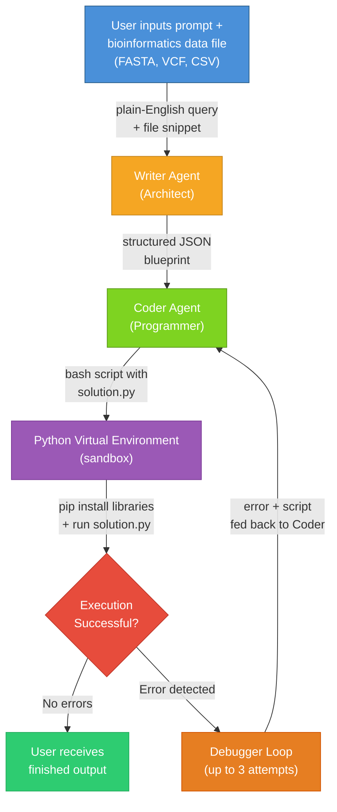

---

## Collaboration & Credits
This project was originally developed as a Senior Capstone Design project at VCU. 

* **My Role:** Architectural modular design, outlining the blueprints for each agent (`schemas.py`), implementing the multi-agent execution pipeline (`agents.py`), and managing environment configurations.
* **Advisor:** Tomaz Arodz.
* **System Architecture & Core Development:** *Asmaa Jawad (@AsmaJawad)
* **Team Members:**
   * Carter Struck (@cartaR02)
   * Sona James (@SonaJames12)
   * Mack Hicks (@TacoBell1Fan)

# Project Summary
- A multi-agent AI system that uses open-source large language models (LLMs) to automatically process, analyze, and interpret genomic datasets.
- Users provide a bioinformatics data file (FASTA, VCF, CSV) and a plain-English request — the system generates and executes a Python analysis script automatically.
- Two specialized AI agents collaborate: a Writer Agent that creates a structured execution plan, and a Coder Agent that generates and runs the Python code.
- Designed to reduce the time required to process and interpret genomic data by 50% compared to traditional bioinformatic workflows.

# Objective
- Develop a functional multi-agent AI system using open-source LLMs capable of processing, coding, and interpreting genomic datasets
- Design and implement an AI-based tool that can automatically generate and execute Python code for bioinformatic tasks
- Deliver accurate and reliable solutions generated by the AI system
- Reduce time required to process and interpret data by 50% compared to traditional bioinformatic workflows

# Problem
- The complexity of current bioinformatic tasks dealing with large datasets creates barriers for non-bioinformaticians
- Genomic datasets often require a trained bioinformatician to decipher and extract meaningful insights
- Our multi-agent AI system simplifies this process by reading genomic data, analyzing it, and producing useful and understandable insights automatically

# Design Constraints
- Must run on NVIDIA A100 40GB GPU
- LLM parameter sizes limited to 20 Billion
- Open source LLMs only
- No Chinese LLMs
- Reasonable completion speed for output
- Agents must debug and produce runnable Python code

# Design Choices
- We use Llama 3.1 Pro Coder (8B parameters) for both the Writer and Coder agents, loaded with 4-bit NF4 quantization to fit on a single GPU
- Both agents share the same model but use different system prompts and temperature settings (Writer: 0.1 for structured output, Coder: 0.0 for deterministic code)
- A self-correction loop feeds sandbox errors back to the Coder agent, allowing up to 3 automatic retries before reporting failure

# Tools
- Python 3.10+
- PyTorch (with CUDA)
- Hugging Face Transformers
- BitsAndBytes (4-bit NF4 quantization)

# Languages
- Python
- Bash

# Frameworks
- Hugging Face (model hosting and inference)
- Pydantic (structured JSON schemas)
- Biopython (FASTA/sequence parsing)

# System Architecture



# Project Structure
```
Code/
├── main.py          # Orchestrator — CLI entry point, runs the pipeline
├── agents.py        # Agent system prompts and few-shot examples
├── schemas.py       # Pydantic models for JSON blueprint structure
├── sandbox.py       # Isolated sandbox executor
├── tools.py         # External API tools (placeholder)
├── input/           # Drop your data files here
│   └── proteins.fasta
├── output/          # Generated results appear here
│   ├── solution.py
│   └── output.log
└── venv/
```

# Usage
```bash
# Place your data file in the input/ folder, then run:
python3 main.py input/proteins.fasta

# Direct mode — provide the query inline
python3 main.py input/variants.vcf "Filter SNPs with quality > 30 and depth > 10"
```

# Demo: Sample Files & Prompts

Three sample data files are included in `input/` to demonstrate the system's capabilities across all supported formats.

### Demo 1: FASTA — Protein Sequence Analysis
**File:** `input/proteins.fasta` (8 human protein sequences from UniProt: p53, BRCA1, MLH1, and others)

```bash
python3 main.py input/proteins.fasta "For each protein sequence, calculate the sequence length, amino acid composition, and molecular weight estimate using an average of 110 Da per residue. Report results per protein."
```

**Expected output:**
```
Protein: sp|P04637|P53_HUMAN - Cellular tumor antigen p53
  Sequence Length: 182 residues
  Estimated Molecular Weight: 20020 Da
  Amino Acid Composition: P=29, L=16, A=16, E=15, S=15, D=10, ...

Protein: sp|P38398|BRCA1_HUMAN - Breast cancer type 1 susceptibility protein
  Sequence Length: 183 residues
  Estimated Molecular Weight: 20130 Da
  Amino Acid Composition: L=24, S=16, E=16, K=16, ...
...
```

### Demo 2: VCF — Variant Filtering & Summary
**File:** `input/variants.vcf` (25 variants across chromosomes 1-7, with SNPs, insertions, and deletions)

```bash
python3 main.py input/variants.vcf "Filter to keep only PASS variants with read depth > 20, then count how many SNPs, insertions, and deletions remain. Print a summary per chromosome."
```

**Expected output:**
```
Filtered variants (PASS, DP > 20): 15 of 25

Variant type distribution:
  SNP: 12
  DEL: 2
  INS: 1

Per chromosome:
  chr1: 3 variants
  chr2: 3 variants
  chr3: 3 variants
  ...
```

### Demo 3: CSV — Differential Gene Expression
**File:** `input/expression_counts.csv` (20 cancer-related genes with 3 control and 3 treatment replicates)

```bash
python3 main.py input/expression_counts.csv "Calculate the mean expression for control and treatment groups, compute the log2 fold change for each gene, and identify significantly upregulated genes (log2FC > 1) and downregulated genes (log2FC < -1). Sort by fold change."
```

**Expected output:**
```
Gene Expression Analysis (20 genes)

Upregulated (log2FC > 1):
  HDM2      control_mean=95.0   treatment_mean=460.0   log2FC=2.28
  IL2RA     control_mean=31.0   treatment_mean=390.0   log2FC=3.65
  TNF       control_mean=45.7   treatment_mean=523.3   log2FC=3.52
  PGR       control_mean=55.7   treatment_mean=698.3   log2FC=3.65
  TP53      control_mean=321.7  treatment_mean=1483.3  log2FC=2.21
  ...

Downregulated (log2FC < -1):
  MLH1      control_mean=421.7  treatment_mean=201.7   log2FC=-1.06
  TGFB1     control_mean=623.3  treatment_mean=311.7   log2FC=-1.00
  AR        control_mean=891.7  treatment_mean=453.3   log2FC=-0.98
  PTEN      control_mean=753.3  treatment_mean=350.0   log2FC=-1.11
  ...

Unchanged:
  KRAS, SCARB1, MTOR, ATM, BRCA1
```

# What's Next?
- Expand support for additional bioinformatics file formats (BAM, BED, GFF)
- Evaluate and integrate specialized coding LLMs for improved code generation accuracy
- Add support for multi-file analyses and cross-sample comparisons
- Build a simple web interface so non-technical users can interact without the command line
